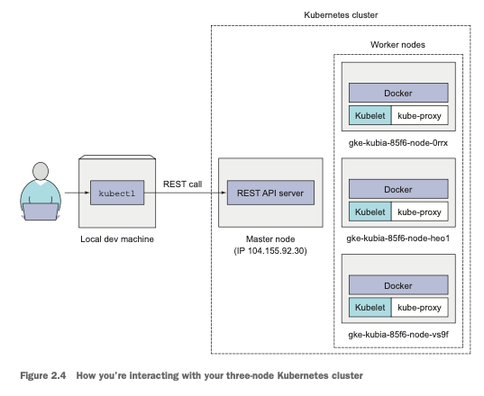

```shell
# 2.10 Minikube 가상머신 시작하기
minikube start

# 2.11 클러스터 정보 표시하기
kubectl cluster-info

gcloud container clusters list # Get GKE Clusters

# 2.13 kubectl 로 클러스터 노드 조회
kubectl get nodes
kubectl describe node minikube # minikube 오브젝트 세부 사항 확인

source <(kubectl completion zsh) # zsh kubectl 자동 완성 설정
```



* 각 노드는 도커, Kubelet, kube-proxy 를 실행
* kubectl 명령어는 마스터 노드에서 실행 중인 쿠버네티스 API 서버로 REST 요청 -> 클러스터와 상호작용