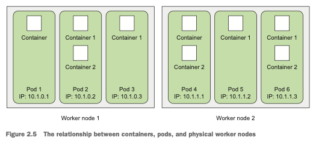
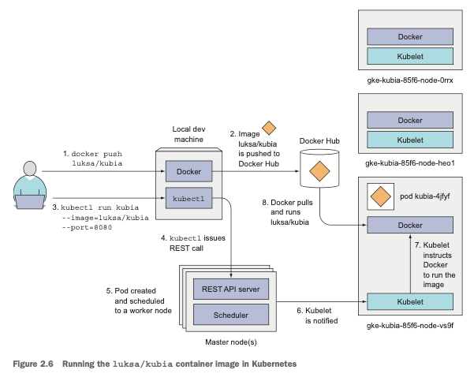
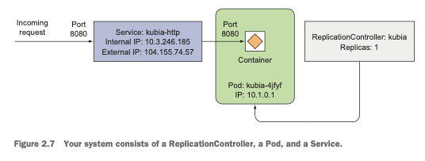
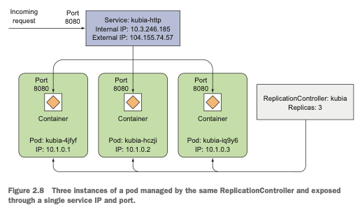

```shell
# 2.1 에서 생성해 도커 허브에 푸시한 이미지를 실행
# 예제에 있는 --generator 옵션은 k8s v1.18 이전에는 pod 생성을 위해 사용했지 이후 버전부터는 필요가 없다.
# 대신 kubectl run --generator=run-pod/v1 또는 kubectl create 를 사용하는 것이 좋다.
kubectl run kubia --image=hyooo/kubia --port=8080
kubectl create deployment kubia --image=hyooo/kubia --port=8080

#2.14 파드 조회하기
kubectl get pods
kubecolor describe pod kubia # 파드 세부정보 확인

# 생성한 deployment 외부 노출시키기
kubectl expose deployment kubia --type=LoadBalancer --name kubia-http

# 2.16 서비스 조회하기
kubectl get services
kubectl get svc

# 2.3.4 deployment 확인
kubectl get deployments
kubectl get deploy

# 레플리카 수 늘리기
kubectl scale deploy kubia --replicas=3
kubectl get pods # 파드 확인시 3개로 늘어난 것을 확인 할 수 있다.

kubectl cluster-info | grep dashboard # GKE 쿠버네티스 대시보드
minikube dashboard # minikube 대시보드
```

### **Pod (파드)**
  * 파드는 하나 이상의 밀접하게 연관된 컨테이너 그룹 (쿠버네티스는 개별 컨테이너를 직접 다루지 않는다.)
  * 같은 워커 노드에서 같은 리눅스 네임스페이스로 함께 실행된다.
  * 각 파드는 자체 IP, 호스트 이름, 프로세스 등이 있는 논리적으로 분리된 머신
  * 각 파드는 고유한 IP 와 애플리케이션 프로세스를 실행하는 하나 이상의 컨테이너를 가진다.



---

### 백그라운드에서 일어난 동작 이해하기


1. 이미지 빌드 후 도커 허브 푸시
2. kubectl 명령어 실행 (`kubectl run kubia --image=hyooo/kubia --port=8080`)
3. 쿠버네티스 API 서버로 REST HTTP 요청 전달
4. 클러스터에 새로운 레플리케이션 컨트롤러 오브젝트 생성
5. 레플리케이션 컨트롤러가 새로운 파드 생성, 스케줄러에 의해 워커 노드 중 하나에 스케줄링
6. 워커 노드의 Kubelet 이 파드 스케줄링 파악 -> 이미지가 없기 떄문에 도커 레지스트리에서 이미지 Pull
7. 이미지 다운로드 후 도커는 컨테이너 생성 및 실행

---

* 외부에서 실행 중인 파드에 접근하기 위해서는 LoadBalancer 유형의 특별한 서비스 생성이 필요
  * 각 파드는 자체 IP 를 가지고 있지만 이는 클러스터 내부에 있어 외부에서 접근이 불가능
  * 외부에서 접근하기 위해서는 서비스 오브젝트를 통해 노출해야함

---

## 2.3.3 시스템의 논리적인 부분

### 레플리케이션 컨트롤러, 파드, 서비스가 서로 동작하는 방식


1. `kubectl run` 명령 실행 
2. 레플리케이션 컨트롤러 생성 
3. 레플리케이션 컨트롤러가 실제 파드 생성

### 파드와 컨테이너의 이해

* 파드는 원하는만큼 컨테이너를 포함시킬 수 있다.

### 레플리케이션 컨트롤러의 이해

* 항상 정확히 하나의 파드 인스턴스를 실행하도록 지정
* 파드를 복제하고 항상 실행 상태로 만든다.

### 서비스가 필요한 이유

* 파드는 일시적 (ephemeral)
* 파드가 사라질 경우, 레플리케이션 컨트롤러에 의해 생성된 파드로 대체
* 새로운 파드는 다른 IP 주소를 할당받음


* 서비스는 항상 변경되는 파드의 IP 주소 문제와 여러 개의 파드를 단일 IP 와 포트의 쌍으로 노출시키는 문제를 해결
* **서비스가 생성되면 정적 IP 를 할당받고 서비스가 존속하는 동안 변경되지 않는다.**
* 클라이언트는 서비스 IP 를 통해 파드로 연결해야함
* **서비스는 동일한 서비스를 제공하는 하나 이상의 파드 그룹의 정적 위치를 나타낸다.**

---

## 2.3.4 애플리케이션 수평 확장

### 시스템의 새로운 상태 시각화



* 하나의 레플리케이션 컨트롤러
* 파드 인스턴스 3개가 모두 레플리케이션 컨트롤러에 의해서 관리된다.

---