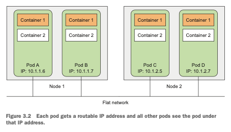

# Index
1. [3.1 파드 소개](#31-파드-소개)  
   1. [3.1.1 파드가 필요한 이유](#311-파드가-필요한-이유)
   2. [3.1.2 파드 이해하기](#312-파드-이해하기)
   3. [3.1.3 파드에서 컨테이너의 적절한 구성](#313-파드에서-컨테이너의-적절한-구성)

---

# 3.1 파드 소개

* 파드는 함께 배치된 컨테이너 그룹이며, **쿠버네티스의 기본 빌딩 블록**
* 컨테이너를 개별적으로 배포하기 보다는 컨테이너를 가진 파드를 배포하고 운영
* 파드가 여러 컨테이너를 가지고 있을 경우, 모든 컨테이너는 항상 하나의 워커 노드에서 실행되며 여러 워커 노드에 걸쳐 실행되지 않는다. (Figure 3.1)

---

## 3.1.1 파드가 필요한 이유
### 여러 프로세스를 실행하는 단일 컨테이너보다 다중 컨테이너가 나은 이유
> IPC(Inter-Process Communication) 혹은 로컬 파일을 통해 통신하는 여러 프로세스로 구성되어,  
> 같은 노드에서 실행하는 애플리케이션을 고려

* 컨테이너는 단일 프로세스 실행을 목적으로 설계됨
* 단일 컨테이너에서 관련 없는 다른 프로세스를 실행하는 경우, 모든 프로세스를 실행하고 로그를 관리하는 것은 모두 사용자 책임
  * ex) 개별 프로세스가 실패하는 경우, 자동으로 재시작하는 메커니즘 포함
* 이러한 모든 프로세스는 동일한 표준 출력으로 로그를 기록 -> 어떤 프로세스가 남긴 로그인지 파악하는 것이 어렵다.
* **각 프로세스를 개별 컨테이너로 실행해야 한다.**

* Q) 그러면 하나의 파드에 2개 이상의 컨테이너가 실행될 경우, 로그는 어떤 식으로 관리 되는가?
  * 컨테이너는 자체적으로 로그 생성, 해당 로그는 컨테이너의 표준 출력 (stdout) 및 표준 에러 (stderr) 스트림을 통해 생성
  * `kubectl logs <pod-name> -c <container-name>` 형식으로 특정 파드 및 컨테이너 로그 확인 가능
  * 로그 시스템으로 ELK 스택을 기반으로 한 EFK 스택 (Elasticsearch, Fluentd, Kibana) 혹은 Prometheus 와 Grafana 와 같은 다른 모니터링 및 로깅 도구 사용 가능
  * `stdout` 및 `stderr` 로그를 파일로 저장하는 로그 파일 기반 로깅 옵션 제공 (쿠버네티스가 제공)

---

## 3.1.2 파드 이해하기
> 파드가 필요한 이유  
> 여러 프로세스를 단일 컨테이너로 묶지 않기 때문에, 컨테이너를 함께 묶고 하나의 단위로 관리할 수 있는 또 다른 상위 구조가 필요하다.  

### 같은 파드에서 컨테이너 간 부분 격리
* 쿠버네티스는 파드 안에 있는 모든 컨테이너가 자체 네임스페이스가 아닌 동일한 리눅스 네임스페이스를 공유하도록 도커를 설정한다.
* 모든 컨테이너는 같은 호스트 이름과 네트워크 인터페이스를 공유
  * 파드의 모든 컨테이너는 동일한 네트워크 네임스페이스와 UTS 네임스페이스 (Unix Timesharing System Namespace) 안에서 실행되기 때문
* 단, 파일 시스템은 다른 컨테이너와 완전히 분리된다.

### 컨테이너가 동일한 IP 와 포트 공간을 공유하는 방법
* 파드 안의 컨테이너가 동일한 네트워크 네임스페이스에서 실행되기 때문에, 동일한 IP 주소와 포트 공간을 공유한다.
* 다만, 동일한 파드 안의 컨테이너에서 실행 중인 프로세스가 같은 포트 번호를 사용하지는 않도록 주의해야 한다. (포트 충돌)

### 파드 간 플랫 네트워크 소개
* 쿠버네티스 클러스터의 모든 파드는 하나의 플랫 (flat) 한 공유 네트워크 주소 공간에 상주하므로 모든 파드는 다른 파드의 IP 주소를 사용해 접근하는 것이 가능 (figure 3.2)
* 서로 다른 파드 사이에는 어떠한 NAT (Network Address Translation) 도 존재하지 않는다.
* 일반적으로 물리 네트워크 위에 추가적인 소프트웨어 정의 네트워크 계층을 통해 달성

---

## 3.1.3 파드에서 컨테이너의 적절한 구성
* 파드는 별도의 머신이 아니라, 특정한 애플리케이션만 호스팅한다.
* 파드는 상대적으로 가볍기 때문에 오버헤드 없이 필요한 만큼 파드를 가질 수 있다.
* 모든 것을 파드 하나에 넣는 대신에 애플리케이션을 여러 파드로 구성하고, 각 파드에는 밀접하게 관련 있는 구성 요소나 프로세스만 포함

### 다계층 애플리케이션을 여러 파드로 분할
* 프론트엔드 서버와 데이터베이스 컨테이너 두 개로 구성된 단일 파드를 구성하기 보다 파드를 분리하여 워커 노드를 효율적으로 사용하라

### 개별 확장이 가능하도록 여러 파드로 분할
* 두 컨테이너를 하나의 파드에 넣지 말아야 하는 다른 이유는 스케일링 때문
* 파드는 스케일링의 기본 단위다.
* 쿠버네티스는 개별 컨테이너를 수평으로 확장할 수 없고, 대신 전체 파드를 수평으로 확장한다.
  * 특정 컨테이너가 있는 파드를 2개로 늘리면, 결국 해당 컨테이너가 2개가 된다.

### 파드에서 여러 컨테이너를 사용하는 경우
* 여러 컨테이너를 단일 파드에 넣는 주된 이유는 figure 3.3 과 같이 애플리케이션이 하나의 주요 프로세스와 하나 이상의 보완 프로세스로 구성된 경우이다.

* EX)
  * 주 컨테이너 : 특정 디렉터리에서 파일을 제공하는 웹 서버
  * 추가 컨테이너 (사이드카 컨테이너) : 외부 소스에서 주기적으로 컨텐츠를 받아 웹 서버의 디렉터리에 저장
* 사이드카 컨테이너로는 로그 로테이터와 수집기, 데이터 프로세서, 통신 어댑터 등이 있다.

### 파드에서 여러 컨테이너를 사용하는 경우의 결정
> 컨테이너를 파드로 묶어 그룹으로 만드는 경우,  
> 두 개의 컨테이너를 단일 파드에 넣을지 vs 두 개의 별도 파드에 넣을지 결정 하기 위한 질문

* 컨테이너를 함께 실행해야하는가, 서로 다른 호스트에서 실행할 수 있는가?
* 여러 컨테이너가 모여 하나의 구성 요소를 나타내는가, 개별적인 구송 요소인가?
* 컨테이너가 함께, 혹은 개별적으로 스케일링 돼야 하는가?

* 기본적으로 특정한 이유 때문에 컨테이너를 단일 파드로 구성하는 것을 요구하지 않는다면, 분리된 파드에서 컨테이너를 실행하는 것이 좋다. (figure 3.4 참고)

